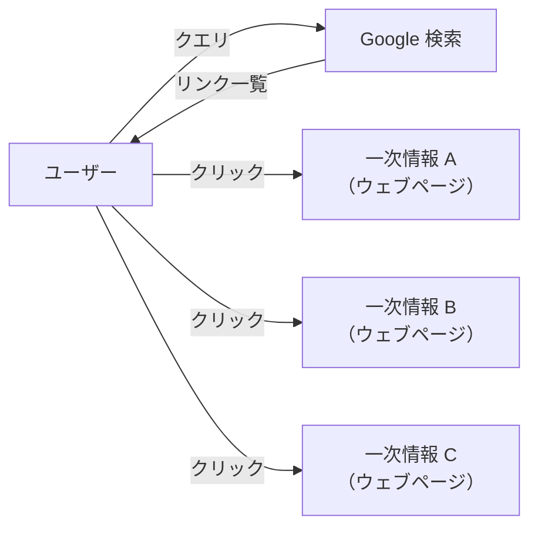
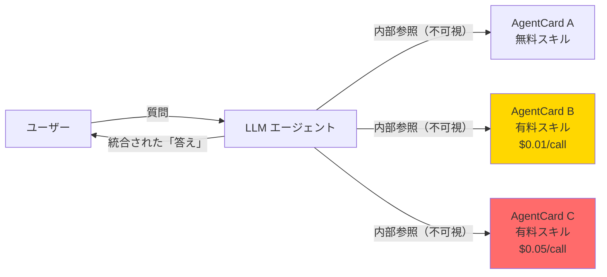
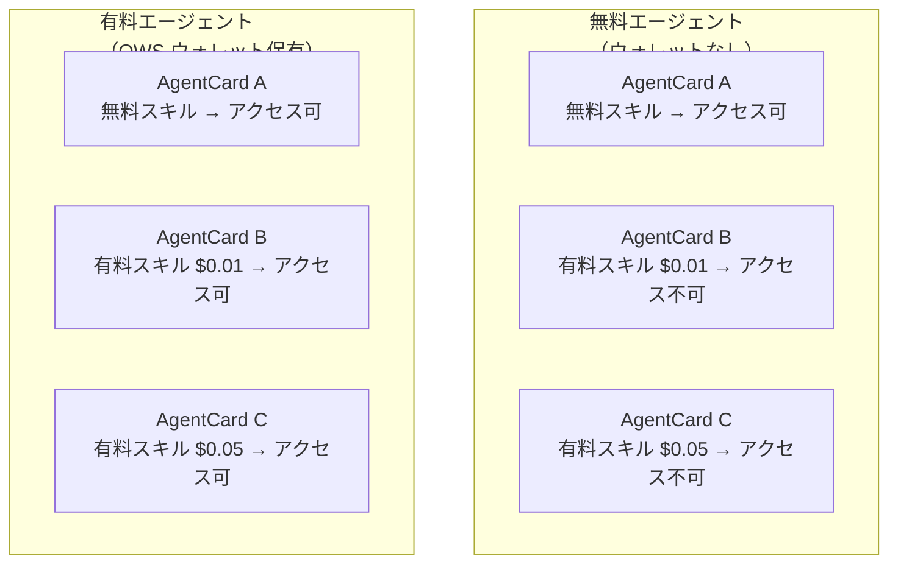
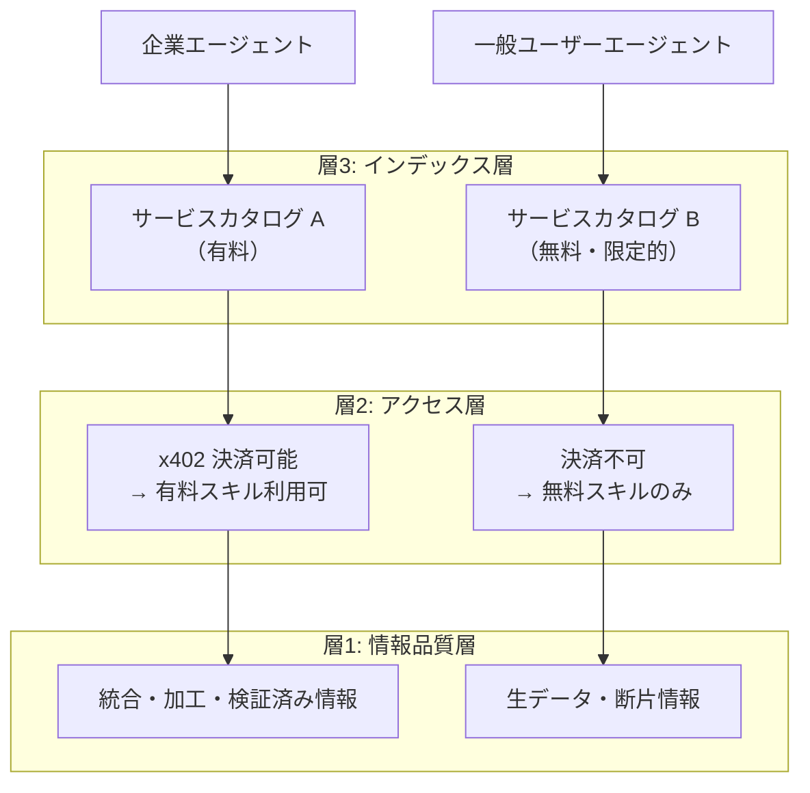
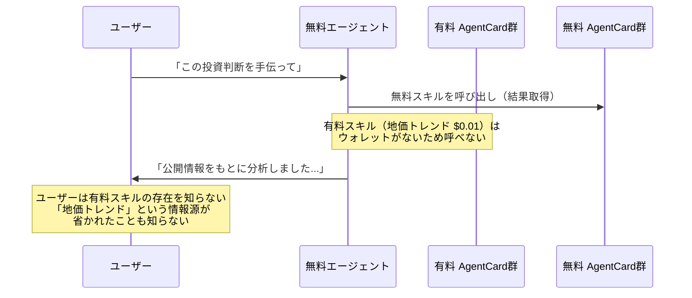
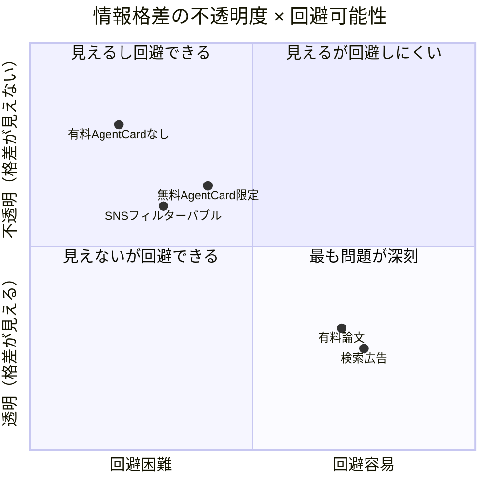
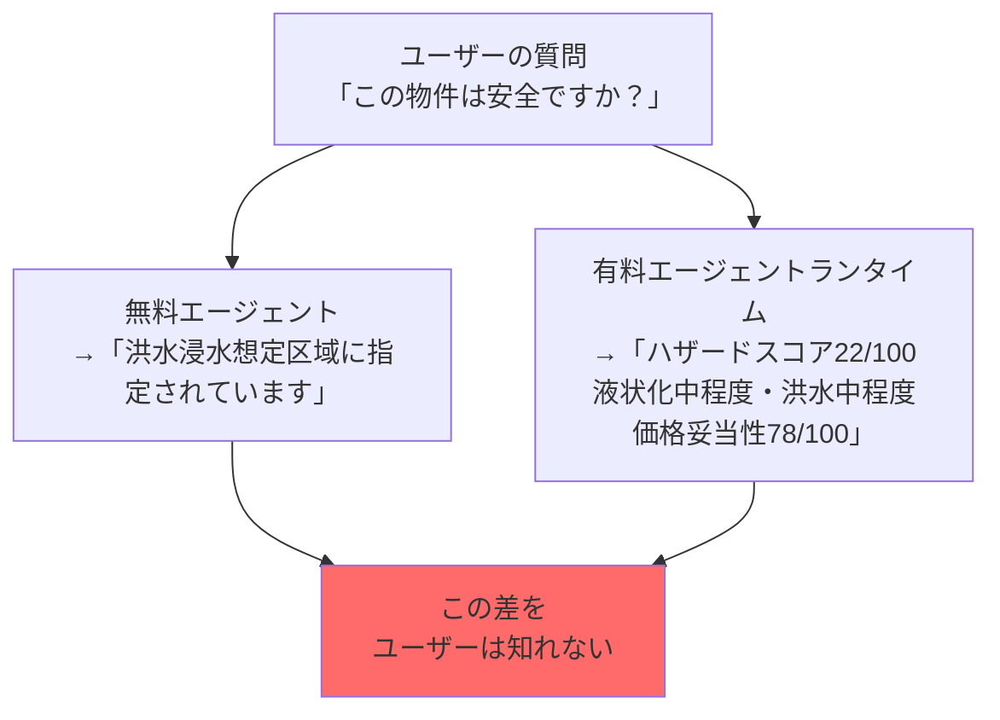

## はじめに：見えない「情報の壁」

検索エンジンが当たり前だった時代、ユーザーは何かを知りたければ Google に聞いた。返ってくるのは「リンクの一覧」だ。クリックすれば一次情報に直接到達できる。広告は「広告」と明示される。

AI エージェントが当たり前になりつつある今、この前提が静かに崩れ始めている。

ユーザーはエージェントに質問し、エージェントは「答え」を返す。その「答え」がどんな情報源から生成されたか、どんな情報が省かれたか、なぜその情報源が選ばれたか──ユーザーには見えない。

そして、AgentCard × x402 による**有料エージェント経済**が普及した世界では、この「見えない壁」がさらに構造化される。有料の AgentCard に接続したエージェントと、無料の AgentCard しか使えないエージェントでは、**見える世界が根本的に変わる**。

しかも問題は、ユーザーには「何が見えていないか」自体がわからないことだ。

この記事では、この構造を技術的に分解する。

---

## 第1章：Google 検索と LLM エージェントの「構造的違い」

### 検索エンジン：リンクを返す仲介者

Google 検索の役割は「答えを出す」ことではない。「関連するウェブページへのリンクを返す」ことだ。



このモデルの重要な特性：
- **透明性**：検索結果に「どのページが返ってきたか」が見える
- **一次情報へのアクセス**：ユーザーが自分でリンクをたどって原文を確認できる
- **広告の明示**：スポンサーリンクは「広告」ラベルが付く（2001年から義務化）
- **比較可能性**：複数のリンクを比較して判断できる

### LLM エージェント：答えを返す仲介者

LLM エージェントは「答え」を返す。その答えを生成するために、複数の情報源を参照しているが、その過程はユーザーに見えない。



このモデルの構造的特性：
- **不透明性**：どのスキルを呼んだか、何を呼ばなかったかがユーザーに見えない
- **一次情報からの切り離し**：情報が要約・統合された段階でユーザーに届く
- **選択の非表示**：「なぜこの情報源を選んだか」の基準が不可視
- **欠如の不可視性**：「本来呼べたはずの有料スキルを呼ばなかった」という事実が見えない

### 構造的違いの技術的整理

| 観点 | Google 検索 | LLM エージェント |
|---|---|---|
| 返すもの | リンク（ポインタ） | 答え（合成された情報） |
| 一次情報へのアクセス | ユーザーが自分でたどれる | エージェントが仲介（ユーザーは到達しない） |
| 情報の選択基準 | PageRank（おおむね公開） | モデル内部 + ポリシー（非公開） |
| 省かれた情報の可視性 | 検索結果外のページが存在することは自明 | 何が省かれたか見えない |
| 有料コンテンツの扱い | リンクが返る（本文は有料でも存在は見える） | 有料スキルを呼ばなかった事実が見えない |

---

## 第2章：AgentCard × x402 が何をもたらすか

AgentCard と x402 については既存記事で詳しく解説している。

@[card](https://zenn.dev/zono819/articles/llm-agentcard-gap)

@[card](https://zenn.dev/zono819/articles/mlit-mcp-x402-a2a)

簡単に整理すると：

- **AgentCard**：`/.well-known/agent-card.json` に置かれた「エージェントのデジタル名刺」。他のエージェントがサービスを自律発見できる
- **x402**：HTTP 402 ステータスコードを使った自律決済。USDC での即時マイクロペイメントが可能
- **有料スキル**：AgentCard 内の `x402` フィールドに価格が記載されたスキル。呼び出しには決済が必要

```json
{
  "skills": [
    {
      "id": "hazard-score",
      "description": "不動産ハザードスコアを返す",
      "x402": { "priceUsdc": "0.01", "network": "base" }
    }
  ]
}
```

このスキルは呼び出すたびに $0.01 USDC がかかる。OWS（Open Wallet Standard）対応エージェントだけが自律的に決済できる。

### 無料と有料で「見える情報の質」が変わる

`llm-agentcard-gap.md` で触れたように、AgentCard には無料と有料が存在する。



同じ質問に対して、2つのエージェントが返す「答え」の質は根本的に違う。

例：「この物件のリスクを教えて」という質問に対して

| エージェント種別 | 利用できるスキル | 返せる情報 |
|---|---|---|
| 無料エージェント | 公開 MLIT データ（生データ） | 「洪水浸水想定区域に指定されています」 |
| 有料エージェント | hazard-score($0.01) + condo-price-validity($0.02) | 「ハザードスコア22/100（液状化中・洪水中）、価格妥当性78/100」 |

情報の深さ・精度・判断可能性が異なる。そして、**ユーザーには両者が「同じように答えている」ように見える**。

---

## 第3章：情報非対称性の構造──「見えないことが見えない」

### 3層の非対称性

AgentCard 経済における情報非対称性は、3つの層で構造化される。



**層3（インデックス層）の非対称性**

2026年5月現在、AgentCard の横断インデックスは存在しない（`llm-agentcard-gap.md` 参照）。つまり「どのドメインに AgentCard が存在するか」を発見するには、サービスカタログを使うか、AgentCard の所在を知っている必要がある。

有料のサービスカタログが登場した場合、「どんな AgentCard が存在するか」の発見可能性自体に格差が生まれる。

**層2（アクセス層）の非対称性**

x402 による有料スキルは、OWS ウォレットを持つエージェントしか呼び出せない。OWS の統合は企業のエージェントランタイムで進んでいるが、一般ユーザーが使う ChatGPT や Claude.ai はウォレットを保有しない。

**層1（情報品質層）の非対称性**

MLIT MCP × x402 × A2A の記事で示したように、有料スキルは「複数データを統合・スコアリングした、直接判断に使える情報」を返す。無料では生データが返るだけだ。

### なぜ「何が見えていないか自体がわからない」のか

Google 検索の場合、「知らない情報の存在」を推測できる経路がある。

- 検索結果が10件しか返らなくても、「他にも無数のページが存在する」ことは常識
- 有料会員向けコンテンツはリンクが返り、「このページは有料です」と表示される
- 広告はラベルで識別できる

LLM エージェント経由では、この経路が閉じる。



ユーザーの立場から見ると：
1. 有料 AgentCard が存在することを知らない
2. エージェントがどのスキルを「呼ばなかったか」を知らない
3. 返ってきた「答え」が有料スキルを使った場合と比べてどれだけ劣化しているかを知らない

これが「見えないことが見えない」構造だ。

### 企業エージェント vs 一般ユーザーエージェント

企業が自社のエージェントに OWS ウォレットと有料 AgentCard アクセスを組み込んだとき、情報格差はさらに広がる。

| 利用主体 | エージェント環境 | 情報アクセス | 意思決定品質 |
|---|---|---|---|
| 大手不動産会社 | OWS + 複数有料 AgentCard 統合 | 地価・ハザード・都市計画の統合スコア | 根拠付きの自律判断が可能 |
| 中小業者 | 無料エージェント（チャット LLM） | 公開データの断片情報 | 要確認事項が増える |
| 一般ユーザー | 無料 LLM（ChatGPT 等） | 生データ or 一般的な知識 | 要専門家確認 |

この格差は従来の「情報格差」と質が異なる。従来は「情報へのアクセス権を持つかどうか」の問題だったが、AgentCard 経済では「エージェントが自律的に統合できる情報の品質の問題」になる。

---

## 第4章：既存の情報格差との比較──なぜ AgentCard はより不透明か

### 比較1：有料論文（Sci-Hub 問題）

学術論文は購読者にしか閲覧できない。しかし：
- 論文の**存在自体は無料で確認できる**（タイトル・著者・アブスト）
- 「この論文は有料です」と明示される
- DOI でアクセス先が特定できる
- Sci-Hub 等の回避手段が存在する（適法かどうかは別として）

AgentCard 経済では：
- 有料スキルの**存在が AgentCard に記載**されるが、AgentCard を発見できなければ知る手段がない
- エージェントが「この情報は有料スキル経由でしか取れない」と伝えない場合、ユーザーは不可視
- 回避手段は「エージェントを変える」だが、自分のエージェントが有料スキルを使っていないかどうかの確認方法がない

### 比較2：広告混じり検索（Google 広告）

検索広告は有料掲載によって上位表示されるコンテンツだ。しかし：
- 「広告」ラベルが義務付けられている（EU・日本の規制）
- 広告と自然検索を**ユーザーが区別できる**
- EU の Digital Services Act（DSA）等で透明性開示が義務化

AgentCard 経済では：
- どの AgentCard スキルが「有料」かは AgentCard に記載されるが、エージェントの出力には通常表示されない
- エージェントが有料スキルを使ったことを出力に明示する**標準フォーマットが存在しない**（2026年5月時点）
- 「このエージェントはどの有料 API を使っているか」を外部から確認する手段がない

### 比較3：フィルターバブル（SNS アルゴリズム）

SNS のパーソナライゼーションも「何が省かれているかが見えない」問題を持つ。ただし：
- フィルターバブルの概念は広く認知されており、**存在の問題が可視化されている**
- EU の DSA 等でアルゴリズム透明性の開示が義務化されつつある
- アルゴリズムなしのフィードを選択できるプラットフォームが増えている

AgentCard 経済での非対称性は：
- 概念自体がまだ広く認知されていない
- 規制フレームワークが整備されていない
- 「有料スキルなし版と有料スキルあり版で比較する」手段がユーザーにない

### 不透明性の比較表



---

## 第5章：緩和できる構造・できない構造

### 緩和できる構造

**① 無料 AgentCard の存在**

AgentCard に `x402` フィールドがないスキルは無料で呼び出せる。政府機関・公益法人・オープンデータ提供者が無料 AgentCard を公開することで、基本的な情報アクセスは担保できる。

MLIT 地理空間 MCP サーバーのような公式データソースは、原則無料で提供される。これをラップした無料 AgentCard が増えれば、基盤となる情報格差は縮小できる。

**② オープンソースエージェントランタイム**

OWS（Open Wallet Standard）は MIT ライセンスの Rust 実装だ。一般ユーザーが自分のウォレットをエージェントに統合できる技術的な経路は存在する。

@[card](https://github.com/open-wallet-standard/core)

課題は「技術的に可能」と「一般ユーザーが使えるか」の乖離にある。

**③ AP2 によるクレジットカード払い拡張**

AP2（Agent Payments Protocol）が普及すれば、USDC ウォレットなしにクレジットカードで有料スキルを利用できる。「決済の壁」は下がる。

**④ 標準化による透明性確保**

A2A v1.0 の Signed AgentCard は AgentCard の発行者を検証できる。将来的に「エージェントが使用したスキルの開示フォーマット」が標準化されれば、使用した情報源の透明性が向上する可能性がある（現状は検討段階）。

### 緩和しにくい構造

**① AgentCard インデックスの不在**

2026年5月時点で、AgentCard の横断インデックスは存在しない。「どんな AgentCard が存在するか」の発見可能性自体が、サービスカタログの品質に依存する。

```
問題の構造:
- 有料のサービスカタログが登場 → 「より多くの AgentCard を知れる権利」に格差
- 無料のサービスカタログは登録 AgentCard 数が少ない
- 結果: 有料エージェントはより多くのスキルを「知っている」状態になる
```

Google のウェブインデックスは（完全ではないが）公共財として機能してきた。AgentCard インデックスの公共財化が実現しないと、発見層の格差は固定化する。

**② エージェント出力の情報源開示**

エージェントが「この答えを生成するために使ったスキルの一覧」をユーザーに開示する標準が現状存在しない。個別のエージェント実装が独自に行うしかなく、強制力がない。

```
比較:
- Google: 検索結果のリンク先が明示（Googleが表示したくても隠せない構造）
- LLM エージェント: 情報源の開示は任意（エージェント実装に委ねられる）
```

**③ 「欠如の認識」問題**

最も根本的な問題は、**ユーザーが「何を聞けば有料スキルが必要か」を事前に知れない**ことだ。

有料論文の場合、「この論文は有料です」という情報を得るには、論文の存在を先に知っている必要がある。しかしエージェント経由では、そもそも「有料スキルを使えばより精度の高い答えが得られる」という問い自体をユーザーが立てられない。



---

## まとめ：問い直すべき「情報の門番」の設計

AgentCard × x402 によるエージェント経済は、情報流通の構造を根本的に変える。

Google 検索がリンクを返す「透明な仲介者」だったのに対して、LLM エージェントは「答えを返す不透明な仲介者」になる可能性がある。そこに有料 AgentCard の格差が加わると、**「見えない情報格差」が社会に埋め込まれる**。

技術的に緩和できる部分は確かにある：
- 無料 AgentCard の普及
- OWS + AP2 による決済民主化
- 標準化による情報源開示

しかし緩和しにくい構造も存在する：
- AgentCard インデックスの公共財化が実現しない場合の発見層格差
- 「何を聞いたら有料スキルが必要か」を事前に知れない構造的問題

現時点（2026年5月）でこの問題を論じる意味は、**インフラが固まる前に設計レベルで対処できるかどうか**にある。

検索エンジンの透明性規制は、Googleが市場支配力を確立してから整備された（EU DMA は2022年）。AgentCard 経済では、同じ後追いにならないための議論が、今まさに必要な段階だ。

:::message
**本記事における憶測・推測箇所について**

- AgentCard インデックスの「有料化」が進むかどうかは未確定（第3章・第5章）
- エージェント出力の情報源開示標準化の可否は未確定（第5章）
- 企業 vs 一般ユーザーの格差が実際にどの程度生じるかは普及規模に依存（第3章）

技術的な事実（AgentCard の仕様、x402 の仕組み、OWS の存在）は各章で引用している公式仕様・実装を根拠としています。
:::

---

## 参考

本記事の前提技術を解説した関連記事：

@[card](https://zenn.dev/zono819/articles/llm-agentcard-gap)

@[card](https://zenn.dev/zono819/articles/mlit-mcp-x402-a2a)

**A2A プロトコル仕様**

@[card](https://a2a-protocol.org/latest/)

**A2A × x402 参照実装**

@[card](https://github.com/google-agentic-commerce/a2a-x402)

**Open Wallet Standard**

@[card](https://github.com/open-wallet-standard/core)

---

*本記事は 2026年5月時点の情報をもとに執筆しました。AgentCard 仕様・x402・OWS はいずれも活発に更新中のため、最新状況は各公式リポジトリをご確認ください。*
