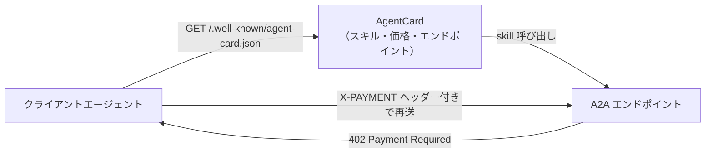
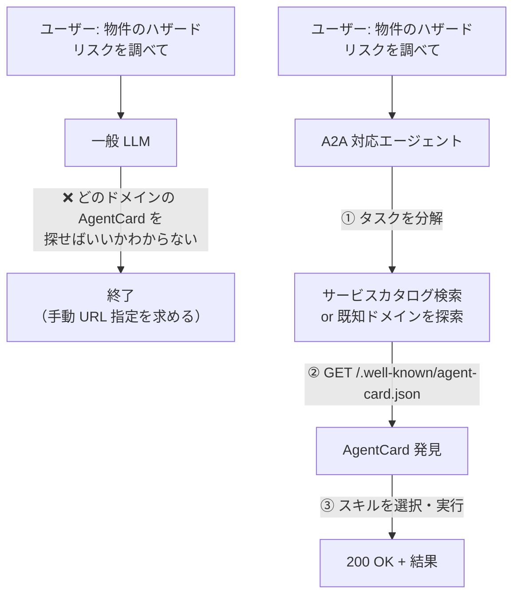
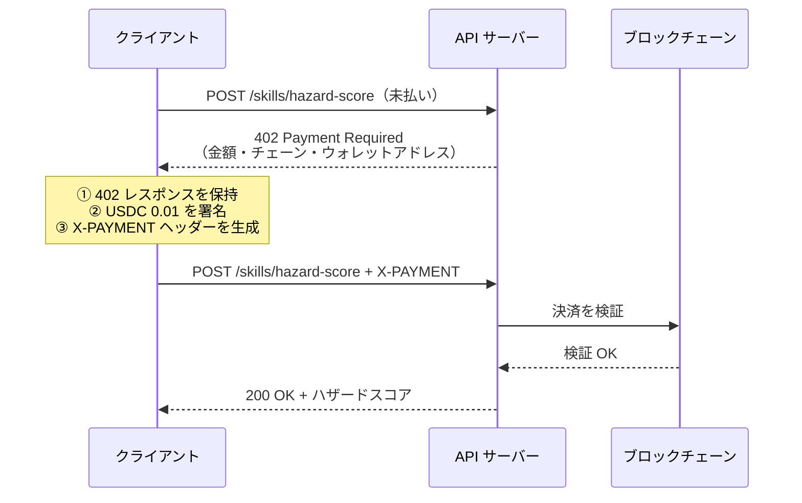
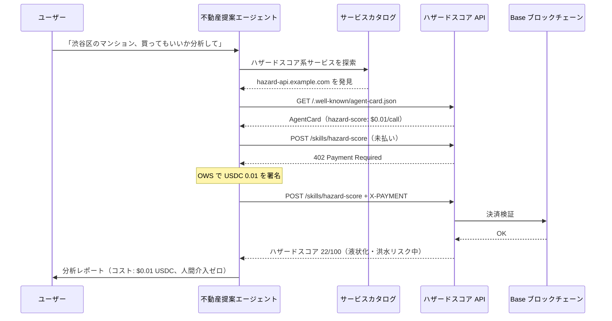
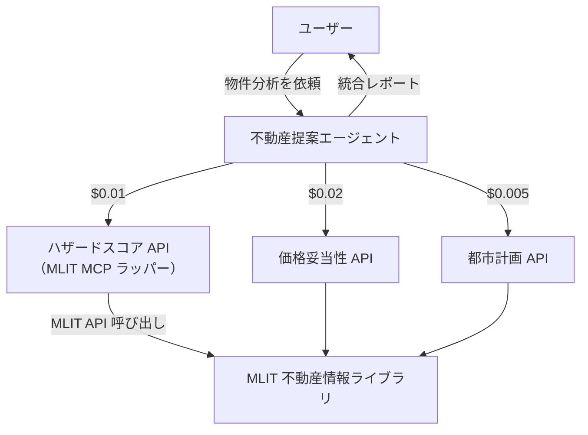

## はじめに：「AgentCard を取得して使って」は今どうなるか

ChatGPT や Claude.ai にこう頼んでみたとする。

> 「`https://example.com/.well-known/agent-card.json` を取得して、そこに書いてあるサービスを使って」

ブラウジング機能を持つモデルなら、JSON を取得して内容を読み上げることはできる。しかし「そこに書かれているサービスを**自律的に発見・決済・利用**する」という A2A 本来の動き方はできない。

なぜか？ 4 つの壁がある。

| 壁 | 一般チャット LLM の現状 | A2A 対応エージェント |
|---|---|---|
| **① 発見** | URL を手動指定すれば取得できる | タスク開始時に自律探索 |
| **② 継続** | 単発応答、taskId 管理なし | taskId + contextId でマルチターン |
| **③ 決済** | ウォレット非保有・署名不可 | OWS で秘密鍵署名 |
| **④ 認証** | OAuth2/mTLS の自動管理不可 | Extended AgentCard へのアクセス可 |

この記事では4つの壁を技術的に分解し、「壁がなくなる条件」「なくなったとき何が起きるか」を整理する。

---

## 前提：AgentCard とは何か

AgentCard は A2A（Agent-to-Agent）プロトコルが定める「エージェントのデジタル名刺」だ。

- **配置場所**: `https://{domain}/.well-known/agent-card.json`（RFC 8615 準拠）
- **役割**: エージェントが提供するスキル・エンドポイント・認証方式・決済条件を機械可読な JSON で公開する
- **発見方法**: HTTP GET で誰でも取得できる（基本版）。拡張版（Extended AgentCard）は OAuth2/mTLS が必要

```json
{
  "name": "Hazard Score API",
  "url": "https://example.com/a2a",
  "skills": [
    {
      "id": "hazard-score",
      "description": "不動産ハザードスコアを返す",
      "x402": { "priceUsdc": "0.01", "network": "base" }
    }
  ],
  "extensions": [
    { "uri": "https://github.com/google-a2a/a2a-x402/v0.1", "required": true }
  ]
}
```

`extensions` に `a2a-x402` の URI が含まれている場合、このエージェントのスキルを呼ぶには x402 による自律決済が必要になる。



A2A v1.0（Linux Foundation 移管後）では **Signed AgentCard**（暗号署名付き）も導入され、AgentCard の発行者がドメイン所有者であることを検証できるようになった。

---

## 壁① 発見のタイミング問題──「いつどこを探すか」がわからない

一般チャット LLM は**受動的存在**だ。ユーザーの入力を待ち、1 回の会話サイクルで応答して止まる。

AgentCard の自律発見には「**タスクのゴールを理解し、そのゴールに必要なサービスを自律的にサーチする**」というステップが必要だ。



一般チャット LLM がブラウジングツールを持っていても、「どのドメインの AgentCard を取りに行くか」をユーザーに聞かずに決める仕組みがない。これは**ツールの有無ではなく、自律的な目標分解とサービス探索エンジンがあるかどうかの問題**だ。

---

## 壁② ステートレス問題──402 → 決済 → 再送ができない

x402 の決済フローには **3 ステップの状態継続**が必要だ。



A2A では `taskId` + `contextId` によってこの 3 ステップが**同一のコンテキスト**として管理される。

一般チャット LLM の問題は：
- 1 回目のリクエストで 402 を受け取る
- **その状態を保持しながら**署名処理を実行する
- **同じ taskId で**続きのリクエストを送る

…という一貫したステートフル処理ができないことだ。通常の LLM セッションはリクエスト/レスポンスの単発サイクルで設計されており、HTTP レイヤーでの状態管理機構を持たない。

---

## 壁③ 決済能力の欠如──ウォレットがない

最大の壁がこれだ。

x402 の `PaymentPayload` には、EVM（secp256k1）または Solana（Ed25519）の**秘密鍵署名**が必要だ。一般チャット LLM はウォレットを保有しない。

| 要件 | 一般チャット LLM | OWS 対応エージェント |
|---|---|---|
| 秘密鍵の保管 | ❌ なし | ✅ ローカル暗号化保管 |
| 署名実行 | ❌ 不可 | ✅ ポリシーゲート通過後に実行 |
| 上限額・チェーン制限 | ❌ 設定不可 | ✅ ポリシーエンジンで制御 |
| マルチチェーン対応 | ❌ 不可 | ✅ EVM / Solana / BTC / Cosmos 等 |

OWS（Open Wallet Standard）は「Local, policy-gated signing and wallet management for every chain」を掲げる Rust 実装のライブラリだ。秘密鍵はローカル暗号化保管され、API は秘密鍵を返さない。署名前にポリシーエンジン（チェーン許可リスト・有効期限・カスタム検証スクリプト）が評価される。

@[card](https://github.com/open-wallet-standard/core)

---

## 壁④ Extended AgentCard──認証の壁

基本の AgentCard は誰でも取得できるが、**Extended AgentCard**（拡張版）には OAuth2 または mTLS（双方向 TLS）が必要だ。拡張版には：

- 内部専用スキルのエンドポイント
- 機密性の高い API パラメータ
- 組織内限定の決済条件

…が含まれる。チャット UI から OAuth2 フローや mTLS クライアント証明書の管理を自動化することは、現状の UX 設計では想定されていない。エージェントランタイムであれば、証明書ストアの管理・OAuth トークンの自動更新・mTLS ハンドシェイクを実装できる。

---

## できるようになる条件

上記 4 つの壁を崩す実装・標準化が進んでいる。

### OWS（Open Wallet Standard）

@[card](https://github.com/open-wallet-standard/core)

ローカル秘密鍵署名基盤。EVM / Solana / Bitcoin / Cosmos 等 10+ チェーン対応。x402 の `PaymentPayload` 署名を標準サポート。MIT ライセンス、Rust 実装。ポリシーエンジンにより「1 回あたり $0.05 以下・Base チェーン限定」などの制約をエージェントに課せる。

### A2A v1.0（Linux Foundation 移管後）

@[card](https://a2a-protocol.org/latest/)

Signed AgentCard（暗号署名付き）の導入により、AgentCard の発行者検証が可能になった。taskId/contextId による状態管理が標準化され、非同期 webhook（pushNotifications）にも対応。

### AP2（Agent Payments Protocol）

Google 主導で FIDO 標準化中の広域決済プロトコル。x402 を暗号資産拡張として内包しつつ、Stripe 経由のクレジットカード払いにも対応する。エージェントが USDC を保有しなくても決済できる世界へ。2026 年 2 月に Stripe が x402 をサポートしたことで、このパスが現実味を帯びた。

### 既存の取り組み

| プロジェクト | 役割 |
|---|---|
| google-agentic-commerce/a2a-x402 | A2A × x402 の参照実装（Python/TS） |
| MoonPay MoonAgents Card | JIT 決済 + OWS + Mastercard 900 万加盟店 |
| Stripe x402 サポート（2026年2月） | クレジットカード払い拡張の入口 |

MoonAgents Card の解説:

@[card](https://zenn.dev/komlock_lab/articles/moonpay-agent-card)

---

## できるようになったら何が起きるか

### シナリオ 1：エージェントが AgentCard を自律発見して決済

不動産提案 AI エージェントが、ユーザーの指示なしに次を実行する：



人間の介入はゼロ。エージェントがサービスを発見・選択・決済・利用して結果を返す。

### シナリオ 2：エージェント同士が直接取引するエージェント経済

複数のエージェントが AgentCard でお互いを発見し、x402 で自律決済する。



この世界では：
- サービス提供者は AgentCard を公開するだけで「エージェント市場」に参入できる
- 人間はトップレベルのエージェントに依頼するだけ。個別 API の存在を知らなくてよい
- マイクロペイメントにより、$0.001 単位の細粒度サービスが成立する

MLIT × x402 × A2A の最小実装例：

@[card](https://zenn.dev/zono819/articles/mlit-mcp-x402-a2a)

---

## 現状の整理：「できる」と「できない」の境界線

| アクション | 一般チャット LLM（2026年5月現在） | A2A 対応エージェントランタイム |
|---|---|---|
| AgentCard の URL を指定して取得 | ✅ ブラウジングツールで可能 | ✅ |
| AgentCard を自律的に発見 | ❌ | ✅ |
| スキルを呼び出す（無料 API） | ✅ 手動 URL 指定なら可能 | ✅ |
| 402 を受けて USDC 署名・再送 | ❌ | ✅ OWS 経由 |
| taskId を跨いだ状態管理 | ❌ | ✅ |
| Extended AgentCard（OAuth2/mTLS） | ❌ | ✅ |
| Mastercard 加盟店への決済（AP2） | ❌ | 🔄 実装中 |

---

## まとめ

一般チャット LLM が AgentCard を「使えない」理由は、ツールの欠如ではなく**アーキテクチャの前提の違い**だ。

- **受動性**: チャット LLM はユーザー指示を待つ。自律的なサービス探索エンジンを持たない
- **ステートレス**: 単発 HTTP サイクルは A2A のマルチターン状態管理と相容れない
- **ウォレット非保有**: x402 決済には秘密鍵署名が必要だが、チャット LLM は保持しない
- **認証管理の欠如**: Extended AgentCard には OAuth2/mTLS が必要

OWS + A2A v1.0 + AP2 が揃い、エージェントランタイムに統合された時、この壁は崩れる。その先にあるのは「エージェントが他のエージェントのサービスを自律発見・購入する」エージェント経済だ。

A2A × x402 参照実装:

@[card](https://github.com/google-agentic-commerce/a2a-x402)

---

*本記事は 2026年5月時点の仕様・実装状況をもとに執筆しました。A2A/AP2/OWS は活発に更新中のため、最新仕様は各公式リポジトリをご確認ください。*
